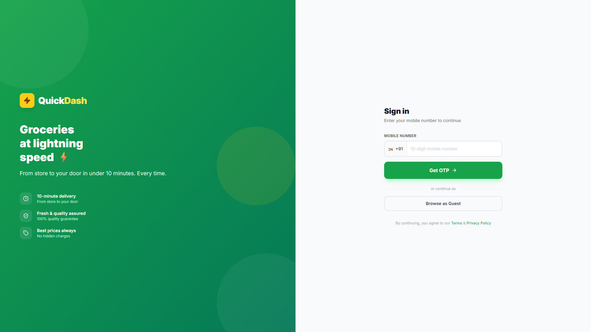
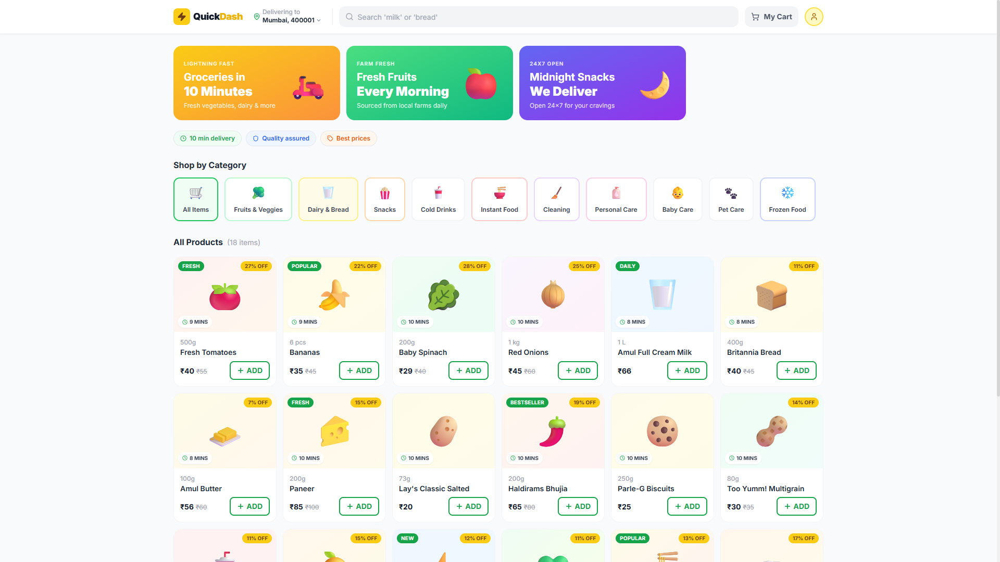

# QuickDash ⚡

**Groceries at lightning speed** — a modern, frontend-only quick-commerce web app inspired by 10-minute delivery platforms. Browse products, manage your cart, checkout, and track your order — all in a fast, mobile-friendly UI.

[](https://quickdash-seven.vercel.app/)


---

## Screenshots

<table>
  <tr>
    <td align="center"><b>Login</b></td>
    <td align="center"><b>Home & Product Catalog</b></td>
  </tr>
  <tr>
    <td></td>
    <td></td>
  </tr>
</table>

---

## Features

- **OTP-style login** — mobile number + OTP flow with guest browsing option *(demo mode)*
- **Product catalog** — 10 categories including Fruits & Veggies, Dairy, Snacks, and more
- **Search & filter** — find products by name or category
- **Shopping cart** — add/remove items, quantity controls, and a slide-out cart drawer
- **Checkout** — address selection, UPI / card / cash-on-delivery options, and order summary
- **Live order tracking** — animated delivery timeline with countdown timer *(demo auto-progress)*
- **Responsive design** — optimized for mobile and desktop with a floating cart bar on small screens

---

## Tech Stack

| Layer | Tools |
|-------|-------|
| Framework | React 18 |
| Build tool | Vite 5 |
| Routing | React Router DOM 6 |
| Styling | Tailwind CSS 3 |
| Icons | Lucide React |
| State | React Context API (`AuthContext`, `CartContext`) |
| Data | Static mock data in `src/data/products.js` |

> **Note:** This is a frontend demo. Authentication, payments, and order tracking are simulated — there is no backend or real API integration yet.

---

## Getting Started

### Prerequisites

- [Node.js](https://nodejs.org/) 18 or higher
- npm (comes with Node.js)

### Installation

```bash
# Clone the repository
git clone https://github.com/daxshonly/quickdash.git
cd quickdash

# Install dependencies (required before first run)
npm install

# Start the development server
npm run dev
```

### Other scripts

```bash
npm run build    # Production build → dist/
npm run preview  # Preview the production build locally
```

---

## Usage

1. Open the app — you'll land on the **Sign in** page.
2. Enter any 10-digit mobile number and click **Get OTP**.
3. Enter any 6-digit OTP to sign in, or click **Browse as Guest**.
4. Browse products, use search or category filters, and add items to your cart.
5. Proceed to **Checkout**, select an address and payment method, and place your order.
6. Watch the **order tracking** screen simulate delivery progress.

---

## Project Structure

```
quickdash/
├── index.html
├── package.json
├── vite.config.js
├── tailwind.config.js
├── postcss.config.js
├── docs/
│   └── screenshots/          # README preview images
└── src/
    ├── main.jsx              # App entry point
    ├── App.jsx               # Providers & router wrapper
    ├── index.css             # Global styles & Tailwind imports
    ├── routes/
    │   └── AppRoutes.jsx     # Route definitions & auth guards
    ├── pages/
    │   ├── Login.jsx         # OTP login & guest access
    │   ├── Home.jsx          # Product listing & search
    │   ├── Cart.jsx          # Full cart page
    │   └── Checkout.jsx      # Checkout & order confirmation
    ├── components/
    │   ├── Navbar.jsx
    │   ├── Hero.jsx
    │   ├── CategoryGrid.jsx
    │   ├── ProductCard.jsx
    │   ├── CartDrawer.jsx
    │   ├── OrderTracking.jsx
    │   ├── QuantitySelector.jsx
    │   └── Footer.jsx
    ├── context/
    │   ├── AuthContext.jsx   # User session state
    │   └── CartContext.jsx   # Cart & order state
    └── data/
        └── products.js       # Categories, products & delivery partner
```

---

## Routes

| Path | Page | Access |
|------|------|--------|
| `/login` | Sign in | Public |
| `/` | Home (product catalog) | Protected |
| `/cart` | Cart | Protected |
| `/checkout` | Checkout & tracking | Protected |

Protected routes redirect unauthenticated users to `/login`.

---

## Demo Mode

This project runs entirely in the browser with mock data:

- **OTP verification** accepts any 6-digit code after a simulated delay
- **Guest login** skips authentication entirely
- **Order tracking** auto-advances through placed → packed → out for delivery → delivered
- **Cart & auth state** resets on page refresh (no persistence)

---

## Roadmap

- [ ] Backend API integration (auth, products, orders)
- [ ] Persistent cart & session (localStorage or database)
- [ ] Real OTP via SMS provider
- [ ] Payment gateway integration
- [ ] Admin panel for product management
- [ ] Dark mode

---

## Contributing

Contributions are welcome! Feel free to open an issue or submit a pull request.

1. Fork the repository
2. Create your feature branch (`git checkout -b feature/my-feature`)
3. Commit your changes (`git commit -m 'Add my feature'`)
4. Push to the branch (`git push origin feature/my-feature`)
5. Open a Pull Request

---

## License

This project is open source and available under the [MIT License](LICENSE).

---

<p align="center">
  Built with ⚡ by <a href="https://github.com/daxshonly">daxshonly</a>
</p>
